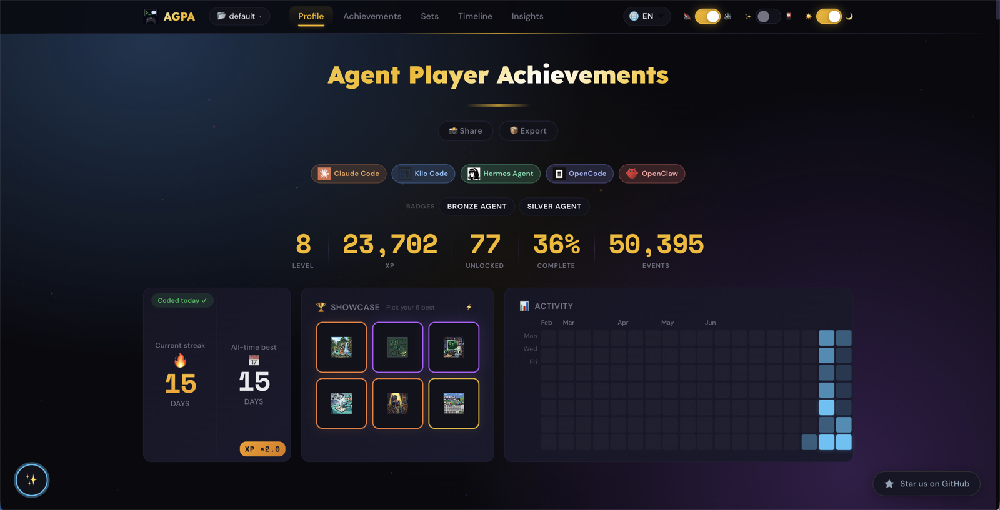
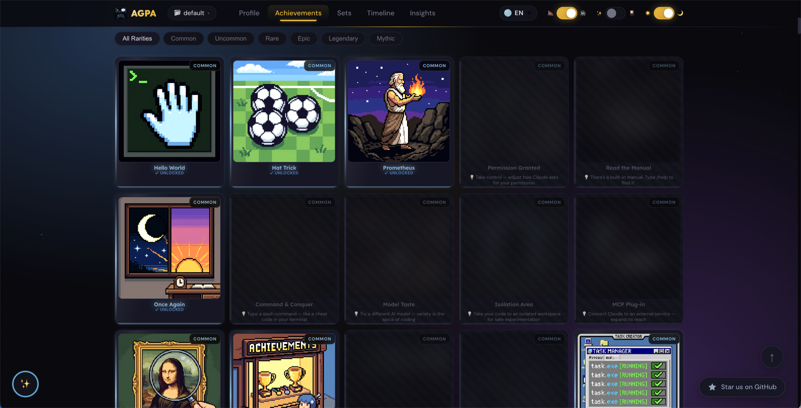
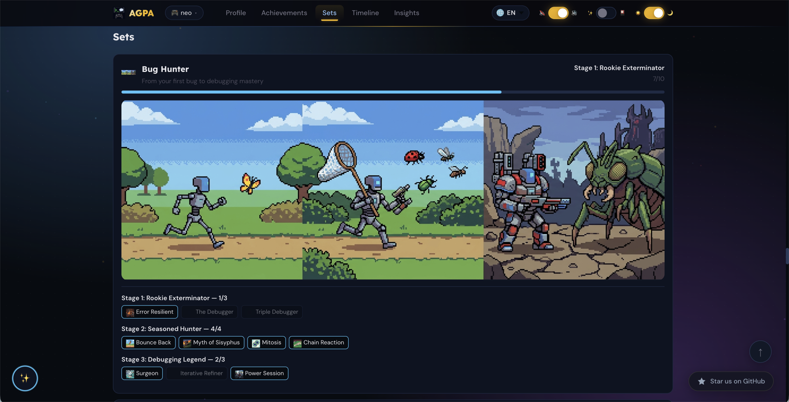
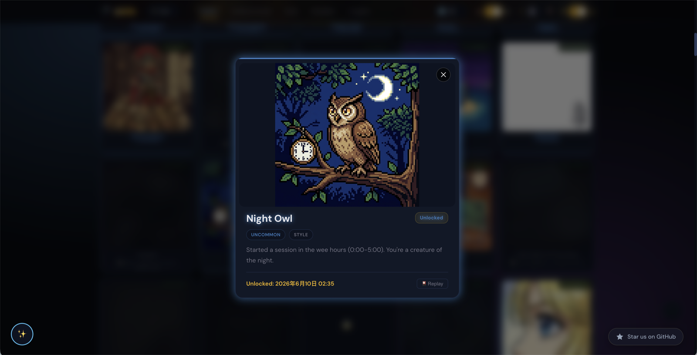

# Agent Player Achievements (AGPA) 🏆

<p align="center">
  <picture>
    <source media="(prefers-color-scheme: dark)" srcset="pixel-art-output/agpa-logo-dark.png">
    <source media="(prefers-color-scheme: light)" srcset="pixel-art-output/agpa-logo-light.png">
    
  </picture>
</p>

<p align="center">
  <a href="./README.md">EN</a>&nbsp;|&nbsp;<a href="./README.zh-CN.md">中文</a>&nbsp;|&nbsp;<strong>ES</strong>&nbsp;|&nbsp;<a href="./README.ko.md">한국어</a>&nbsp;|&nbsp;<a href="./README.ja.md">日本語</a>
</p>

<p align="center">
  Sistema de logros gamificado para agentes de programación con IA.<br>
  <em>Gana XP, desbloquea trofeos, sube de nivel — simplemente haciendo lo que ya haces.</em>
</p>

<p align="center">
  <a href="LICENSE"></a>
  <a href="#"></a>
  <a href="#"></a>
  <a href="#">= 18"></a>
  <a href="#"></a>
  <a href="https://github.com/eiainano/AgentPlayerAchievements"></a>
  <a href="https://github.com/eiainano/AgentPlayerAchievements/commits/dev"></a>
  <a href="README.es.md"></a>
</p>

<p align="center">
  <b>Claude Code</b>&nbsp;·&nbsp;<b>Kilo Code</b>&nbsp;·&nbsp;<b>OpenCode</b>&nbsp;·&nbsp;<b>Hermes</b>&nbsp;·&nbsp;<b>OpenClaw</b>
</p>

<p align="center">
  <a href="#inicio-rápido">Inicio Rápido</a> ·
  <a href="#cómo-funciona">Cómo Funciona</a> ·
  <a href="#características">Características</a> ·
  <a href="#herramientas-compatibles">Herramientas</a> ·
  <a href="#comandos-cli">Comandos CLI</a> ·
  <a href="#paquetes-comunitarios">Paquetes Comunitarios</a> ·
  <a href="#panel">Panel</a> ·
  <a href="#seguridad-y-privacidad">Seguridad</a> ·
  <a href="#contribuir">Contribuir</a> ·
  <a href="#preguntas-frecuentes">FAQ</a>
</p>

---

## Vista Previa

<p align="center">
  <table>
    <tr>
      <td align="center" width="50%">
        <br>
        <sub><b>Inicio</b> — XP, rachas, estadísticas</sub>
      </td>
      <td align="center" width="50%">
        <br>
        <sub><b>成就</b> — 217 logros × 11 categorías</sub>
      </td>
    </tr>
    <tr>
      <td align="center" width="50%">
        <br>
        <sub><b>套装</b> — colecciones con progreso</sub>
      </td>
      <td align="center" width="50%">
        <br>
        <sub><b>Detalle</b> — rareza, fecha, repetición</sub>
      </td>
    </tr>
  </table>
</p>

---

### Sin AGPA ❌

- **Sin visibilidad** de tus hábitos de programación entre sesiones
- **Sin seguimiento de progreso** — ¿eres más rápido? ¿usas más herramientas? Imposible saberlo
- **Sin motivación** para explorar todas las funciones de tu agente
- **La misma rutina** cada día — sin sorpresas, sin hitos

### Con AGPA ✅

- **Seguimiento automático** — cada llamada de herramienta, edición de archivo y commit de git registrado automáticamente
- **Panel estilo Steam** — barra de XP, niveles, rachas, heatmaps, vitrina de logros
- **217 logros** en 11 categorías — desde "Hello World" hasta "Completionist"
- **Retroalimentación instantánea** — ventanas emergentes en terminal, notificaciones macOS, sonidos 8-bit al desbloquear

---

## Inicio Rápido

**Requisitos previos:** Node.js ≥ 18

```bash
# Opción A: instalar globalmente (recomendado para usuarios)
npm install -g @eiainano/agpa
agpa init

# Opción B: clonar y enlazar (recomendado para contribuidores)
git clone https://github.com/eiainano/AgentPlayerAchievements.git
cd AgentPlayerAchievements && npm install && npm link
agpa init
```

Eso es todo. Sigue usando tu agente — los logros se desbloquean automáticamente mientras trabajas.

> [!TIP]
> ¿Quieres ver cómo es el panel sin esperar desbloqueos reales? Ejecuta `agpa demo` para generar datos de muestra al instante.

```bash
agpa dashboard   # abre el panel de logros
agpa stats       # consulta tu progreso
```

## Cómo Funciona

```
Tu Sesión de Programación
  │
  ├─ Tú programas, el agente responde — cada acción se registra
  │   └─ doble canal: herramientas MCP + eventos Hook
  │
  ├─ Fin de sesión → el motor evalúa 217 logros
  │   └─ ¿desbloqueado? → notificación macOS 🎉
  │
  └─ agpa dashboard → ver, ordenar, filtrar, compartir
```

**Dos canales de datos → un motor → un panel:**

| Canal | Método | Captura |
|---------|--------|----------|
| **Hook CLI** | Hooks de herramienta (subproceso vía stdin) | file.read/write/edit, tool.complete, git.commit, session.start/end, task.complete, agent.spawn |
| **Servidor MCP** | Protocolo STDIO (7 herramientas) | image.read, file.language_used, plan.mode_entered, user.message, automode.start |

Ambos canales escriben en el mismo registro de eventos `~/.agent-achievements/`. El motor evalúa 12 tipos de condiciones contra 217 logros.

> [!NOTE]
> **Cero sobrecarga.** El Hook CLI es un subproceso de menos de un milisegundo. El servidor MCP se ejecuta sobre STDIO sin llamadas de red. Todos los datos permanecen en tu máquina.

## Características

- 🎮 **Panel de Logros** — barra de XP, nivel, racha, heatmap de actividad, distribución por rareza, vitrina
- 🏆 **217 Logros** en 11 categorías — desde "Hello World" hasta "Completionist"
- 🔥 **Heatmap de actividad estilo GitHub** — 4 meses de actividad de programación de un vistazo
- 📸 **Tarjeta para Compartir** — tema oscuro/claro, bilingüe, descargable como PNG
- 🔊 **Efectos de sonido 8-bit y notificaciones** — sonidos retro clasificados por rareza + notificaciones push de escritorio al desbloquear
- 📂 **Múltiples perfiles** — hasta 4 perfiles, cambia en cualquier momento (trabajo, personal, experimentación)

## Herramientas Compatibles

<p align="center">
  <a href="#claude-code"></a>
  <a href="#kilo-code--opencode"></a>
  <a href="#kilo-code--opencode"></a>
  <a href="#cursor--vs-code"></a>
  <a href="#cursor--vs-code"></a>
  <a href="#hermes"></a>
  <a href="#openclaw"></a>
</p>

| Herramienta | Auto-track | MCP track | Configuración más fácil |
|------|:----------:|:---------:|---------------|
| Claude Code | ✅ | ✅ | `agpa init` lo detecta automáticamente |
| Kilo Code | ✅ | ✅ | Plugin TS + config MCP |
| OpenCode | ✅ | ✅ | Plugin TS + config MCP |
| Hermes | — | ✅ | Config MCP JSON |
| OpenClaw | ✅ | ✅ | Plugin + config MCP |

Las cinco herramientas tienen cobertura completa de doble canal excepto Hermes (sin API de hooks). Para cualquier cliente compatible con MCP (Cursor, VS Code, Windsurf, etc.), el seguimiento solo MCP funciona de inmediato — solo pierdes el auto-seguimiento basado en hooks.

> [!TIP]
> **¿Nuevo en MCP?** Empieza con `agpa init` — detecta automáticamente tus herramientas instaladas y configura todo. Las configuraciones JSON manuales a continuación son alternativas.

<details>
<summary><b>Claude Code</b> — auto-track + MCP (cobertura completa)</summary>

`agpa init` detecta automáticamente Claude Code y registra ambos canales. Para configuración manual:

**Config MCP** (`~/.claude/.mcp.json` o `.mcp.json` en la raíz del proyecto):
```json
{
  "mcpServers": {
    "agpa": {
      "command": "npx",
      "args": ["tsx", "path/to/AgentPlayerAchievements/src/main.ts"]
    }
  }
}
```

**Registro de Hooks** — `agpa init` añade entradas de hook a tu configuración de Claude Code. Verifica con `agpa verify`.
</details>

<details>
<summary><b>Cursor / VS Code</b> — solo MCP</summary>

Estos editores soportan MCP pero no exponen APIs de hooks para auto-seguimiento. Obtienes seguimiento de llamadas de herramienta vía MCP.

**Cursor** (`.cursor/mcp.json`):
```json
{
  "mcpServers": {
    "agpa": {
      "command": "npx",
      "args": ["tsx", "path/to/AgentPlayerAchievements/src/main.ts"]
    }
  }
}
```

**VS Code** (`.vscode/mcp.json`):
```json
{
  "mcpServers": {
    "agpa": {
      "command": "npx",
      "args": ["tsx", "path/to/AgentPlayerAchievements/src/main.ts"]
    }
  }
}
```
</details>

<details>
<summary><b>Kilo Code / OpenCode</b> — auto-track + MCP (cobertura completa)</summary>

Estas herramientas soportan plugins TS para auto-seguimiento a nivel de hooks. `agpa init` registra el plugin + config MCP.

**Config MCP manual** (`opencode.json` o configuración de Kilo Code):
```json
{
  "mcpServers": {
    "agpa": {
      "command": "npx",
      "args": ["tsx", "path/to/AgentPlayerAchievements/src/main.ts"]
    }
  }
}
```

El plugin TS (registrado por `agpa init`) maneja automáticamente los eventos PostToolUse, SessionStart, SessionEnd y otros hooks.
</details>

<details>
<summary><b>Hermes</b> — solo MCP</summary>

Hermes no expone una API de hooks. El seguimiento basado en MCP cubre llamadas de herramienta y eventos de sesión.

**Config MCP** (`~/.hermes/mcp.json`):
```json
{
  "mcpServers": {
    "agpa": {
      "command": "npx",
      "args": ["tsx", "path/to/AgentPlayerAchievements/src/main.ts"]
    }
  }
}
```
</details>

<details>
<summary><b>OpenClaw</b> — auto-track + MCP (cobertura completa)</summary>

OpenClaw soporta un sistema de plugins para seguimiento a nivel de hooks. `agpa init` registra tanto el plugin como la config MCP.

**Config MCP manual**:
```json
{
  "mcpServers": {
    "agpa": {
      "command": "npx",
      "args": ["tsx", "path/to/AgentPlayerAchievements/src/main.ts"]
    }
  }
}
```
</details>

## Comandos CLI

| Comando | Descripción |
|---------|-------------|
| `agpa init` | Auto-detectar y registrar con tus herramientas de agente |
| `agpa uninstall` | Eliminar AGPA limpiamente de todas las herramientas configuradas |
| `agpa verify` | Verificar la corrección de la instalación |
| `agpa doctor` | Diagnosticar el estado del sistema |
| `agpa dashboard` | Iniciar el panel de logros (localhost:3867) |
| `agpa stats` | Mostrar resumen de progreso de logros |
| `agpa progress` | Listar todos los logros con estado de desbloqueo |
| `agpa profile` | Gestionar perfiles de logros (crear, listar, cambiar, softwares, eliminar) |
| `agpa demo` | Generar datos de demostración MVP para pruebas |
| `agpa reset` | Restablecer todos los datos de seguimiento |
| `agpa config` | Ver/modificar configuración (idioma, sonido, depuración...) |
| `agpa showcase` | Gestionar vitrina (listar, fijar, soltar, auto-llenar) |
| `agpa search` | Buscar logros por palabra clave/rareza/categoría |
| `agpa suggest` | Sugerir el próximo logro a conseguir |
| `agpa sound` | Alternar efectos de sonido 8-bit clasificados por rareza (on, off) |
| `agpa activity` | Ver racha + heatmap de actividad de 4 meses |
| `agpa export` | Exportar datos de logros como JSON |
| `agpa import` | Importar desde copia de seguridad |
| `agpa mcp` | Iniciar servidor MCP (modo stdio) |
| `agpa web` | Alias de `agpa dashboard` |
| `agpa pack` | Listar o inspeccionar paquetes de logros comunitarios |
| `agpa banner` | Cambiar el tema de color del banner CLI (Neon/Arcade/Gold) |
| `agpa history` | Navegar por las entradas del registro de eventos |
| `agpa explain` | Mostrar por qué un logro está bloqueado/desbloqueado (desglose de condiciones) |
| `agpa watch` | Monitor de progreso de logros en tiempo real |
| `agpa upgrade` | Buscar actualizaciones y actualizar AGPA |
| `agpa completion` | Generar script de completado de shell (bash/zsh/fish) |

> Referencia CLI completa: `agpa --help`

## Paquetes Comunitarios

Cualquier persona puede crear y compartir paquetes de logros. Coloca un archivo YAML en `~/.agent-achievements/packs/` para instalarlo:

```bash
agpa pack list              # listar paquetes instalados
agpa pack info <id>         # mostrar detalles del paquete
```

Consulta [Creación de Paquetes de Logros](docs/creating-achievements.md) para conocer el formato, el catálogo de eventos y los 12 tipos de condición.

## Panel

<p align="center">
  <em>Fila de stats → Racha + Heatmap → Vitrina → Cuadrícula de logros con búsqueda/filtro</em>
</p>

```bash
agpa dashboard           # puerto por defecto :3867
agpa dashboard 8080      # puerto personalizado
agpa dashboard --profile work   # iniciar con perfil específico
```

- **Estadísticas**: XP, nivel, total de logros, racha, tareas, usos de herramientas
- **Heatmap**: cuadrícula de actividad de 4 meses estilo GitHub
- **Vitrina**: logros favoritos fijados (hasta 6)
- **Cuadrícula de Logros**: buscar, ordenar por rareza/categoría, filtrar desbloqueado/bloqueado
- **Control de sonido**: efectos 8-bit clasificados por rareza
- **Botón Compartir**: genera una hermosa tarjeta bilingüe → descarga PNG

## Arquitectura

```
                    ┌─────────────────────────┐
                    │   Motor (src/engine/)    │
                    │   track() / poll()       │
                    └─────────────────────────┘
                      ↗                    ↖
            Servidor MCP            Hook CLI
          (src/main.ts)        (src/cli/hook.ts)
                │                        │
          STDIO persistente    subproceso efímero
                │                  (stdin pipe)
                │                        │
          El agente llama       Hooks se disparan
          conscientemente       automáticamente
                │                        │
          ┌─────┴─────┐          ┌──────┴──────┐
          │ Manual     │          │ Auto-track  │
          │ image.read │          │ tool.complete│
          │ lang_used  │          │ file.edit   │
          │ plan.mode  │          │ session.*   │
          │ ...        │          │ agent.spawn │
          └───────────┘          └─────────────┘
                    ╲            ╱
                event.log  ← ambos canales escriben aquí
                          │
                     engine.poll()
                          │
                     state.json
                          │
                       Panel
```

## Estructura del Proyecto

```
src/
├── main.ts                  # Entrada del Servidor MCP (STDIO)
├── tool-registry.ts         # Registro central de herramientas
├── cli/
│   ├── index.ts             # Entrada CLI unificada (27 comandos)
│   ├── hook.ts              # Hook CLI (modos track + poll + auto)
│   ├── init.ts              # Asistente de instalación interactivo
│   ├── dashboard.ts         # Lanzador del panel
│   ├── doctor.ts            # Diagnóstico del sistema
│   │   └── ...                  # 22 comandos CLI adicionales
├── engine/
│   ├── engine.ts            # Motor principal (track / poll / stats)
│   ├── evaluator.ts         # 12 evaluadores de tipos de condición
│   ├── store.ts             # Registro de eventos JSONL + persistencia de estado
│   ├── types.ts             # Interfaces TypeScript
│   └── yaml-parser.ts       # Analizador de definiciones de logros YAML
├── dashboard/
│   ├── server.ts            # Servidor HTTP + rutas API
│   ├── api.ts               # Datos de tarjetas, agregación de estadísticas
│   ├── public/              # Frontend HTML/CSS/JS sin frameworks
│   └── customize-api.ts     # Endpoint de personalización
├── tools/                   # Definiciones de herramientas MCP (7 herramientas)
├── utils/                   # notificaciones, validación, perfiles, pixel-art, batería, etc.
├── verify/
│   └── auditor.ts           # Lógica de verificación de logros
├── config.ts                # Configuración global
└── helpers.ts               # Utilidades compartidas

pixel-art-output/            # Logo (README)
achievement-definitions.yaml   # 217 definiciones de logros (fuente autoritativa)
scripts/                     # herramientas de desarrollo (gen de logo, pixel art, sonidos)
```

## 🔒 Seguridad y Privacidad

- **Local primero** — Todos los datos de eventos permanecen en `~/.agent-achievements/`. Sin telemetría, sin sincronización en la nube, sin llamadas de red en tiempo de ejecución.
- **Auditable** — El motor son funciones TypeScript puras que operan sobre archivos JSONL. Sin ofuscación, sin binarios.
- **Dependencias mínimas** — 5 dependencias runtime (`@modelcontextprotocol/sdk`, `yaml`, `zod`, `figlet`) — todas ampliamente auditadas.
- **Aislamiento STDIO** — El servidor MCP se comunica solo por E/S estándar. Sin endpoints HTTP expuestos.
- **Sandbox de Hooks** — El Hook CLI se ejecuta como un subproceso de menos de un milisegundo — no puede persistir estado ni acceder a la red.
- **Cadena de suministro** — Sin módulos nativos, sin scripts postinstall, sin descargas de binarios en tiempo de instalación.

Para reportar una vulnerabilidad, consulta [SECURITY.md](SECURITY.md).

## 👥 Contribuir

¡Damos la bienvenida a contribuciones! Ya sea un pack de logros, una mejora del Dashboard, una nueva integración de herramientas o una corrección del motor — hay un camino para cada nivel.

- **[CONTRIBUTING.md](CONTRIBUTING.md)** — configuración, convenciones de código, proceso de PR y 4 caminos de contribución
- **[Creación de Paquetes de Logros](docs/creating-achievements.md)** — la guía completa para escribir definiciones de logros
- **[`.github/ISSUE_TEMPLATE/`](.github/ISSUE_TEMPLATE/)** — plantillas de issues y PRs

## 🌐 Variables de Entorno

| Variable | Descripción | Por defecto | Valores |
|----------|-------------|---------|--------|
| `AGPA_PROFILE` | Nombre del perfil activo | `default` | cualquier cadena |
| `AGPA_LANG` | Idioma de la interfaz | `en` | `en`, `zh` |
| `AGPA_ENABLED_CATEGORIES` | Filtrar qué categorías de logros están activas | todas | separadas por comas (ej. `onboarding,tool_mastery`) |
| `AGPA_DEBUG` | Activar registro de depuración detallado | `false` | `true` |
| `AGPA_SOUND` | Anular efectos de sonido | configuración guardada | `on`, `off`, `true`, `false` |
| `AGPA_SIMPLE_ANIMATIONS` | Usar animaciones de terminal simplificadas | `false` | `true` |
| `AGPA_BANNER_THEME` | Estilo del banner de inicio CLI | `Arcade` | `Neon`, `Arcade`, `Gold` |
| `AGPA_TELEMETRY` | Activar telemetría de uso anónima | `false` | `true`, `false` |
| `AGPA_TELEMETRY_SERVER` | URL del endpoint de telemetría personalizado | `''` (ninguno) | cadena URL |
| `AGPA_TOOL_SOURCE` | Anular identificador de origen de herramienta | auto-detectado | `claude-code`, `hermes`, `openclaw`, etc. |
| `AGPA_MODEL` | Nombre del modelo de IA actual (para logros) | `auto` | cualquier cadena de modelo |

> [!TIP]
> Las variables de entorno anulan la configuración de `config.json`. Establécelas en tu perfil de shell o configuración de agente para anulaciones persistentes.

## Preguntas Frecuentes

**P: ¿Esto ralentiza mi agente?**
R: No. El Hook CLI es un subproceso de menos de un milisegundo. El servidor MCP se ejecuta sobre STDIO sin sobrecarga de red.

**P: ¿Puedo usarlo con múltiples agentes?**
R: Sí. El asistente de instalación detecta automáticamente Claude Code, Kilo Code, OpenCode, Hermes y OpenClaw. Cada uno puede tener su propio perfil.

**P: ¿Mis logros no se desbloquean?**
R: Ejecuta `agpa doctor` — diagnostica el estado de seguimiento, registro de hooks y cobertura de eventos.

**P: ¿En qué se diferencia de WakaTime u otros rastreadores de actividad?**
R: WakaTime te dice *qué* hiciste — horas, lenguajes, proyectos. AGPA lo hace *divertido* — XP, niveles, logros, rachas y recompensas estilo Steam. Es gamificación sobre tu flujo de trabajo existente, no otro panel que revisar. Piensa en la diferencia entre el conteo de pasos de un rastreador de fitness y una insignia de Pokémon Go — mismos datos, experiencia diferente.

**P: ¿Puedo personalizar los nombres de los logros?**
R: Sí. La página `/customize` en el panel te permite renombrar cualquier logro.

## Solución de Problemas

> [!IMPORTANT]
> **Primer paso para cualquier problema:** Ejecuta `agpa doctor` — diagnostica el estado de seguimiento, registro de hooks, cobertura de eventos y problemas de configuración de una vez.

| Síntoma | Causa Probable | Solución |
|---------|-------------|-----|
| Los logros no se desbloquean | Hook/MCP no registrado | Ejecuta `agpa doctor` para verificar registro de hooks + cobertura de eventos |
| El panel no inicia | Puerto 3867 ya en uso | `agpa dashboard 8080` (o cualquier puerto libre) |
| `agpa init` falla | Herramienta de agente no detectada | Revisa la lista de herramientas compatibles; usa config MCP JSON manual como alternativa |
| Sin notificaciones macOS | Falta `terminal-notifier` | Ejecuta `brew install terminal-notifier`, o `agpa init` lo instala automáticamente |
| El sonido no se reproduce | Contexto de audio bloqueado por el navegador | Haz clic en cualquier lugar de la página del panel para habilitar el audio |
| El cambio de perfil no funciona | El perfil no existe | `agpa profile list` para ver perfiles disponibles, luego `agpa profile switch <name>` |
| Errores de Hook CLI en logs del agente | stdin pipe vacío (normal en primera ejecución) | Normal — los hooks son subprocesos efímeros; los errores se registran en `~/.agent-achievements/error.log` |

Para problemas persistentes, revisa `~/.agent-achievements/error.log` o [abre un issue](https://github.com/eiainano/AgentPlayerAchievements/issues).

## Historial de Estrellas


## Licencia

MIT — consulta [LICENSE](LICENSE)
